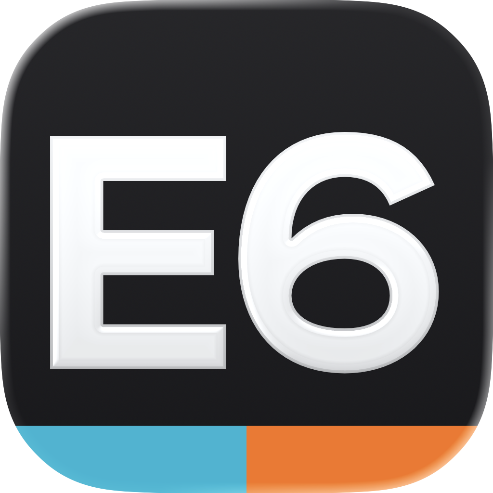
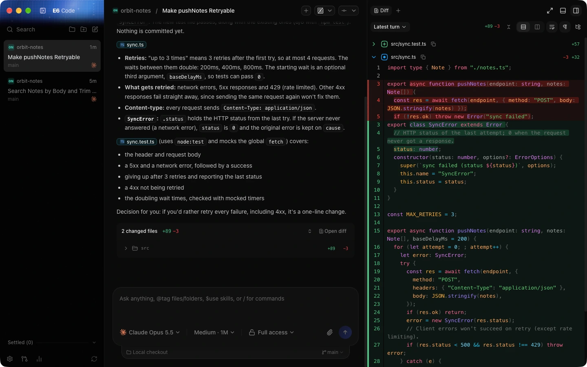

<div align="center">



# E6 Code

**Every coding agent. One control room.**

A fast, open-source GUI for coding agents. Run Claude Code, Codex, Cursor, Grok Build, OpenCode, and
Antigravity side by side with the subscriptions you already have, from your desktop, a browser, or your phone.

[Website](https://e6code.com) · [Download](https://github.com/emikael/e6code/releases) · [Web app](https://app.e6code.com) · [iOS](https://apps.apple.com/us/app/e6-code-remote-claude-more/id6787819824) · [Android](https://play.google.com/store/apps/details?id=com.e6tools.e6code) · [Docs](./docs)



</div>

## Why E6 Code

We wanted the best possible development experience with agents. Codex desktop, Conductor, Claude
Desktop, and Cursor Glass inspired us, but none met our bar. So we built something performant,
remote-ready, and truly open. If we ever go the wrong direction, you have everything you need to fork
it and build the editor you want.

**"Wait, what are you selling me?"** Nothing. E6 Code doesn't resell tokens or proxy your keys. It drives
the provider CLIs already installed on your machine, so your plan, limits, and credentials stay yours.

## What you get

- **Every harness in one place.** Pick Claude Code, Codex, Cursor, Grok Build, OpenCode, or Antigravity per
  thread. Multiple accounts are supported for [Claude](./docs/user/providers-claude.md) and
  [Codex](./docs/user/providers-codex.md).
- **Checkpoints on every turn.** Each turn ends with a hidden git ref, so you can diff exactly what the agent
  changed and [revert to an earlier prompt](./docs/user/composer.md), files included in worktrees.
- **Git without the terminal dance.** Commit, push, and open pull requests on GitHub, GitLab, Bitbucket,
  Azure DevOps, Forgejo, and Gitea. See [source control](./docs/user/source-control.md).
- **Remote ready.** Keep agents running on one machine and drive them from your phone or any browser, over
  your LAN, Tailscale, or E6 Connect. See [remote access](./docs/user/remote-access.md).
- **Jev routing (opt-in).** Classify turns before they reach your provider, so small talk is answered
  locally and simple questions go out with trimmed context. See [usage](./docs/user/usage.md#route-turns-through-jev).
- **Built for the keyboard.** A command palette, configurable [keybindings](./docs/user/keybindings.md),
  an integrated [terminal](./docs/user/terminal.md), and [themes](./docs/user/appearance.md).

## Install

> [!IMPORTANT]
> Install and sign in to at least one provider first:
>
> | Provider    | Install                                               | Sign in                                                  |
> | ----------- | ----------------------------------------------------- | -------------------------------------------------------- |
> | Claude Code | [Claude Code](https://claude.com/product/claude-code) | `claude auth login`                                      |
> | Codex       | [Codex CLI](https://developers.openai.com/codex/cli)  | `codex login`                                            |
> | Cursor      | [Cursor CLI](https://cursor.com/cli)                  | `agent login`                                            |
> | Grok Build  | [Grok Build CLI](https://x.ai/cli)                    | `grok login`                                             |
> | OpenCode    | [OpenCode](https://opencode.ai)                       | `opencode auth login`                                    |
> | Antigravity | No CLI needed                                         | **Settings → Install Antigravity → Sign in with Google** |

### Command line

```bash
# macOS / Linux
curl -fsSL https://e6code.com/install.sh | sh
```

```powershell
# Windows (PowerShell)
irm https://e6code.com/install.ps1 | iex
```

Then run `e6` to start the server and open the local web app.

| Command              | What it does                          |
| -------------------- | ------------------------------------- |
| `e6`                 | Start the server and open the web app |
| `e6 service install` | Keep it running in the background     |
| `e6 update`          | Move to a newer release               |
| `e6 --help`          | Full reference                        |

To try it once without installing, run `npx e6@latest`.

### Desktop app

Download the latest build from [GitHub Releases](https://github.com/emikael/e6code/releases), or use a
package manager:

| Platform                  | Command                         |
| ------------------------- | ------------------------------- |
| macOS (Homebrew)          | `brew install --cask e6-code`   |
| Windows (winget)          | `winget install E6Tools.E6Code` |
| Arch Linux (AUR, stable)  | `yay -S e6code-bin`             |
| Arch Linux (AUR, nightly) | `yay -S e6code-nightly-bin`     |

The AUR packaging lives in [`packaging/aur`](./packaging/aur).

### Mobile

Install the app for [iOS](https://apps.apple.com/us/app/e6-code-remote-claude-more/id6787819824) or
[Android](https://play.google.com/store/apps/details?id=com.e6tools.e6code), then pair it with a running
E6 Code server. See [remote access](./docs/user/remote-access.md).

## Documentation

User guides live in [`docs/user`](./docs/user). There's no docs site yet.

| Getting started                                                   | Working with agents                                 | Running it                                              |
| ----------------------------------------------------------------- | --------------------------------------------------- | ------------------------------------------------------- |
| [Install and first run](./docs/user/install.md)                   | [Messages and context](./docs/user/composer.md)     | [Remote access](./docs/user/remote-access.md)           |
| [Welcome wizard](./docs/user/welcome-wizard.md)                   | [Permission modes](./docs/user/permission-modes.md) | [Background service](./docs/user/background-service.md) |
| [Settings and project overrides](./docs/user/project-settings.md) | [Source control](./docs/user/source-control.md)     | [Updating](./docs/user/updating.md)                     |
| [Keyboard shortcuts](./docs/user/keybindings.md)                  | [Usage and Jev routing](./docs/user/usage.md)       | [Devices](./docs/user/devices.md)                       |

## How it works

A Node WebSocket server wraps the provider CLIs and serves the web, desktop, and mobile clients. Clients
send typed requests, the server turns them into commands, and a pure decider turns commands into persisted
events. A projector derives the read model the UI renders. Per-provider adapters translate each CLI's native
protocol into orchestration events.

| Path                      | What lives there                                             |
| ------------------------- | ------------------------------------------------------------ |
| `apps/server`             | WebSocket server, orchestration, providers, checkpointing    |
| `apps/web`                | React/Vite UI, also wrapped by the desktop app               |
| `apps/desktop`            | Electron shell that bundles the server                       |
| `apps/mobile`             | React Native app for iOS and Android                         |
| `apps/marketing`          | The [e6code.com](https://e6code.com) website                 |
| `packages/contracts`      | Effect/Schema contracts for everything that crosses the wire |
| `packages/client-runtime` | Client code shared by web and mobile                         |

Start at [docs/internals/overview.md](./docs/internals/overview.md) for the architecture.

## Build from source

E6 Code uses [Vite+](https://viteplus.dev/guide/), so you need the global `vp` CLI:

```bash
# macOS / Linux
curl -fsSL https://vite.plus | bash
```

```powershell
# Windows
irm https://vite.plus/ps1 | iex
```

Then install dependencies and start the server and web app:

```bash
vp i
vp run dev
```

The [development runbook](./docs/operations/development.md#first-checkout) covers desktop builds, tests,
and platform prerequisites.

## Contributing

We're very early, so expect bugs. We're (mostly) not accepting contributions yet: small, focused fixes
may be considered, but big features won't be.

- Read [CONTRIBUTING.md](./CONTRIBUTING.md) before reporting a bug or opening a PR.
- Feature ideas go in [Ideas discussions](https://github.com/emikael/e6code/discussions/categories/ideas).
- Report security issues privately through [GitHub security advisories](https://github.com/emikael/e6code/security/advisories/new).

## License

[MIT](./LICENSE)
